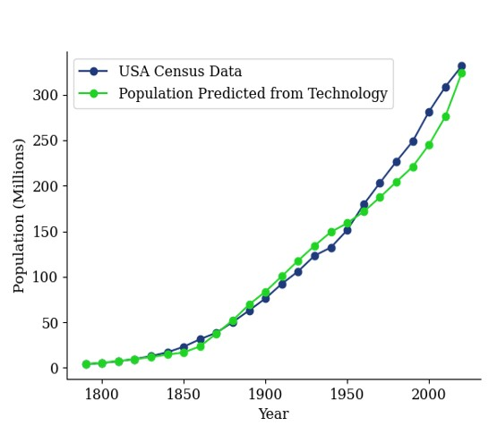

    

      
Foundations of the Science of Economics

      
      

This data-driven book is not based on models nor on correlation coefficients. A variety of functions are optimized to fit the data, and the best function is selected using a new Information Criterion. These Hypotheses are used to make falsifiable predictions, some of which are already tested. Data analyzed include Population, Technology, GDP, the frequency and severity of Wars and Natural Catastrophes and a variety of others. A number of novel Hypotheses are derived from the models.
      

    

{:style="display:block; margin-left:auto; margin-right:auto"}

    

      

This graph is not based on similarities in shape. The individual best-fit models for both Population and Technology are determined first; they turn out to be power-laws. A relationship between the power-laws is observed, and then the relationship between Population and Technology is posited. The resulting graph shows that the relationship has some reality, as the predictions of Population by using the data on Technology match the Population data from the Census. R^2 = 0.9936.
      

    

     
